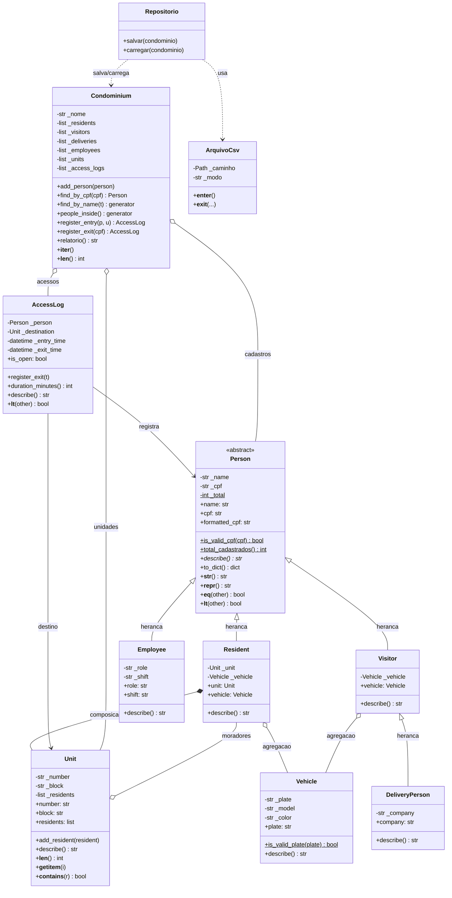
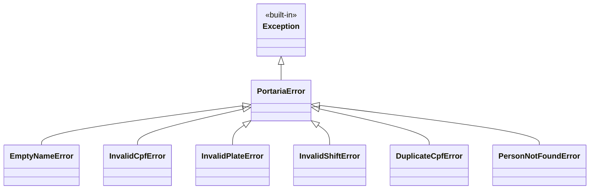
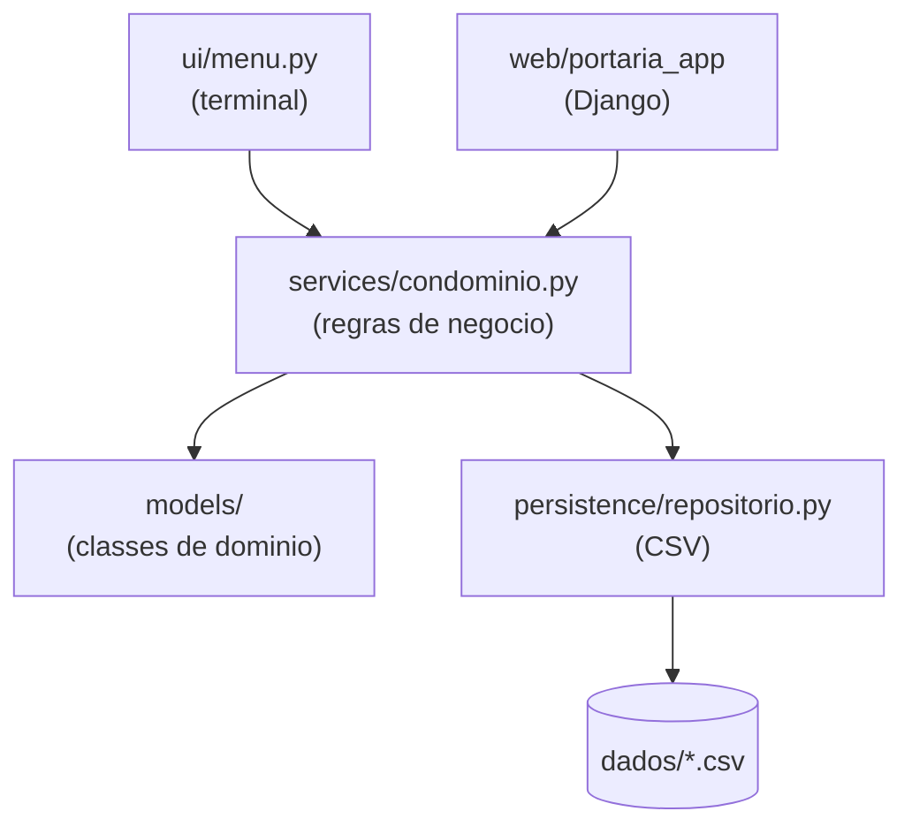

# Diagrama de Classes

Diagrama UML das classes do sistema de portaria, escrito em Mermaid (o
GitHub renderiza automaticamente ao abrir este arquivo).

## Visao geral

## Hierarquia de excecoes

Capturar `PortariaError` captura todas as filhas de uma vez, que e
exatamente o que o menu e as views do Django fazem.

## Arquitetura em camadas

As duas interfaces (terminal e web) usam exatamente as mesmas classes de
dominio e a mesma persistencia. Trocar a interface nao exige mexer em
`models/`.

## Legenda dos relacionamentos

| Simbolo | Nome | Significado no projeto |
|---|---|---|
| `<\|--` | Heranca | `Resident` **e um** `Person` |
| `*--` | Composicao | Um `Resident` sempre pertence a uma `Unit` |
| `o--` | Agregacao | Um `Resident` **pode ter** um `Vehicle` |
| `-->` | Associacao | `AccessLog` aponta para a `Person` que entrou |
| `..>` | Dependencia | `Repositorio` usa `ArquivoCsv` para gravar |
